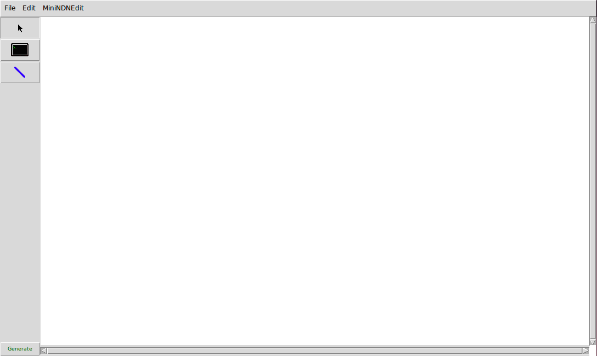
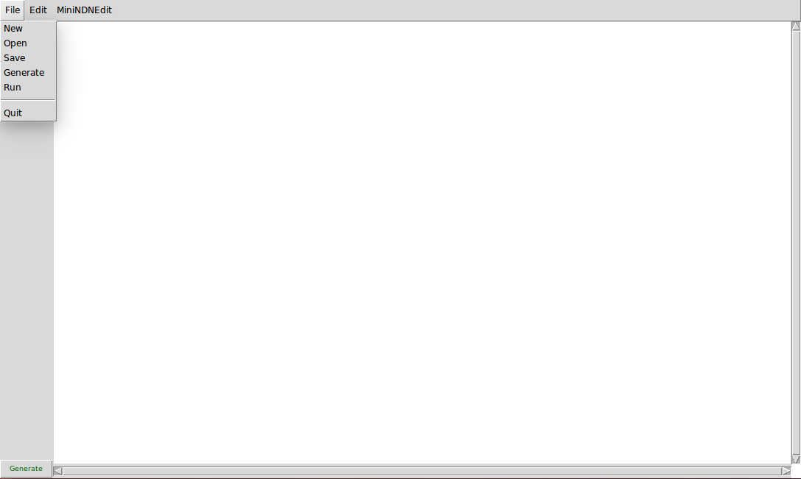
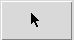
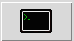
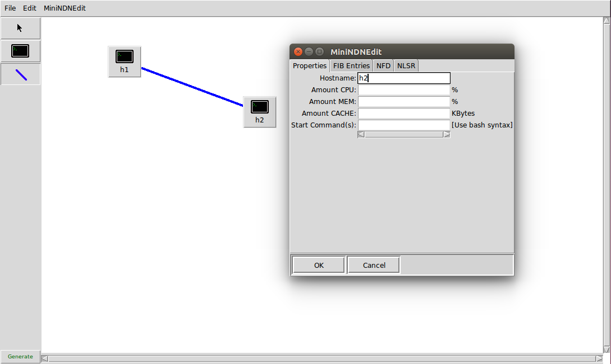
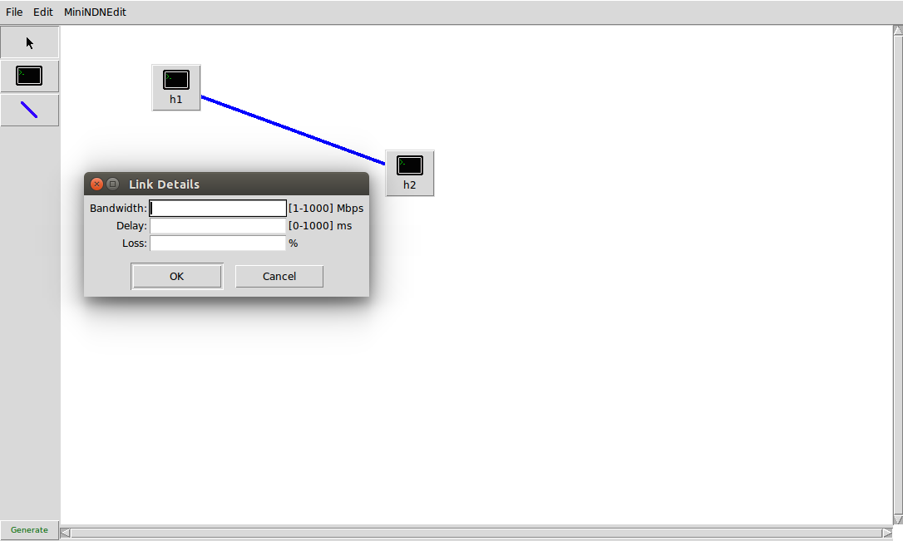

Mini-NDN Edit
=============

Mini-NDN Edit is a GUI program designed to simplify the creation of Mini-NDN topology
configuration files. Mini-NDN Edit allows the user to build a topology, configure the hosts and
links, and generate a topology file that can be used by Mini-NDN.

## Working with topology files

#### File formats

There are two file formats used by Mini-NDN edit.

* `.mnndn` files store topology information used by the GUI. Mini-NDN Edit can open and
save `.mnndn` files.

* `.conf` files are used by Mini-NDN to create and run topologies. Mini-NDN Edit can generate a
`.conf` file from a `.mnndn` file. Mini-NDN edit cannot open `.conf` files. Please see
[CONFIG-FILE.md](CONFIG.md) for more information on the content and format of `.conf` files.

#### File menu

* **New** - Erase the current canvas and provide a new empty topology
* **Open** - Open a `.mnndn` topology file
* **Save** - Save the current topology as a `.mnndn` topology file
* **Generate** - Convert the current topology to a `.conf` file runnable by Mini-NDN
* **Run** - Run the current topology in Mini-NDN. The GUI will disappear and Mini-NDN will run on
            the command-line.
* **Quit** - Exit Mini-NDN edit

## Tools

### Cursor tool

The *cursor tool* is used to select and move nodes in the topology. A selected node or link can be
removed from the topology using the `backspace` key or by selecting `edit/cut`.

### Host tool

The *host tool* is used to add a host node to the topology. Click on the canvas to create a new host
node at the mouse cursor's position.

### Switch tool

The *switch tool* is used to add a switch to the topology. Click on the canvas to create a new
switch at the mouse cursor's position.

### Link tool

The *link tool* is used to connect two nodes with a network link. Click on a node and drag the mouse
cursor to another node to create a link between the two nodes.

## Configuration

#### Editing host information

To edit a host's information and configuration, right-click on the desired node and select
`Host Options`.

The *Host Options* window will include tabs to modify the node's properties as well as the
configuration files for NFD and NLSR on that node.

*Note: Network, Site, and Router in the NLSR tab are unused in v0.1.0*

#### Editing link configuration

To edit a link's configuration, right-click on the desired link and select `Link Options`.

The *Link Options* window will allow configuration of the link's bandwidth, delay, and loss rate.

