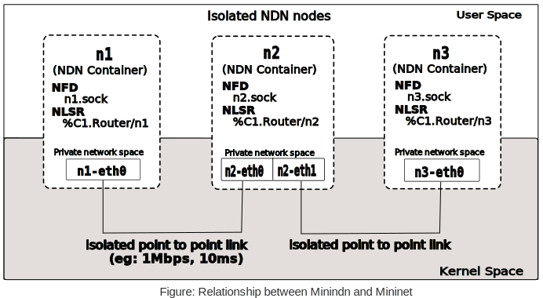

Introduction
=================

If you are new to the NDN community of software generally, read the
`Contributor's Guide <https://github.com/named-data/NFD/blob/master/CONTRIBUTING.md>`_.

What is Mini-NDN?
-----------------

Mini-NDN is a lightweight networking emulation tool that enables testing, experimentation, and
research on the NDN platform. It was initially based on `Mini-CCNx <https://github.com/chesteve/mn-ccnx>`_ which was a fork of `Mininet <https://github.com/mininet/mininet>`_. Mini-NDN uses the NDN libraries, NFD, NLSR, and tools released by the `NDN project <http://named-data.net/codebase/platform/>`_ to emulate an NDN network on a single system.

The first release of Mini-NDN is developed by members of the NSF-sponsored NDN project team.
Mini-NDN is open to contribution from the public.

License
_______

Mini-NDN is open and free software licensed under the GPL 3.0 license. Mini-NDN is free to all
users and developers. For more information about licensing details and limitations,
please refer to COPYING.md.

Feedback/Mailing List
_____________________

Bug reports and feedback are highly appreciated and can be made through our
`Redmine site <http://redmine.named-data.net/projects/mini-ndn>`_ and the
`mini-ndn mailing list <http://www.lists.cs.ucla.edu/mailman/listinfo/mini-ndn>`_.

Video
_____

.. raw:: html

 	

        
Mini-NDN (content maybe outdated)

         <iframe width="600" height="345" src="https://www.youtube.com/embed/UxHPqaUwefg" frameborder="0" allowfullscreen=""></iframe>
    
